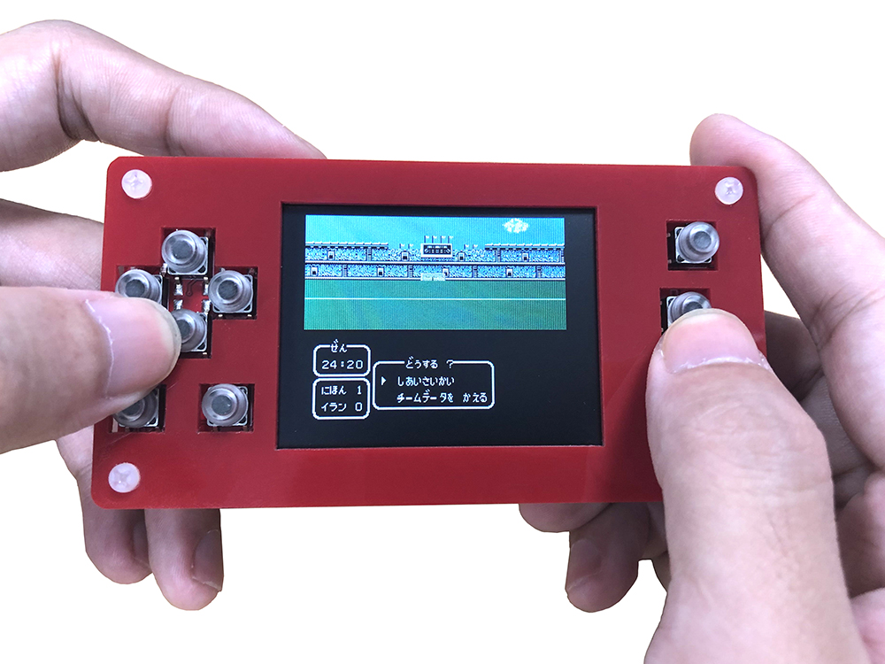
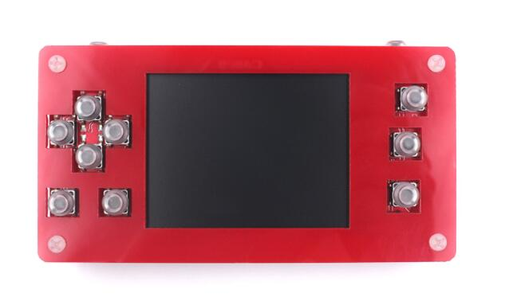
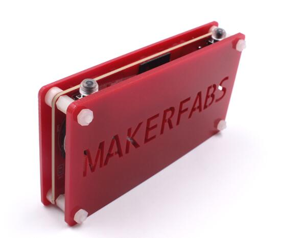
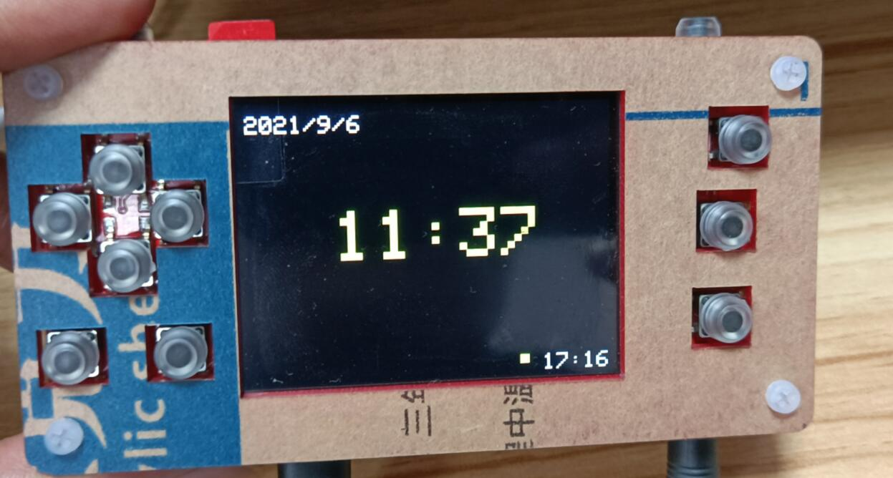
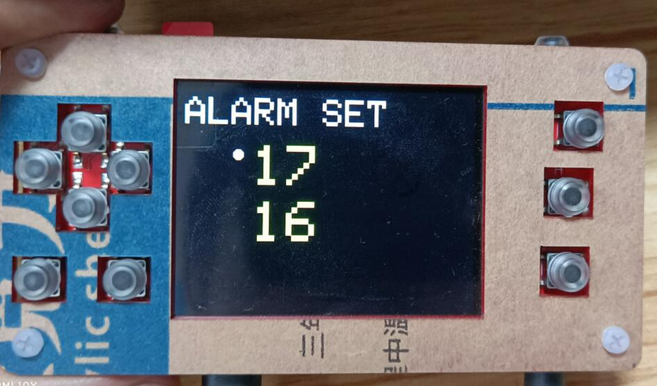
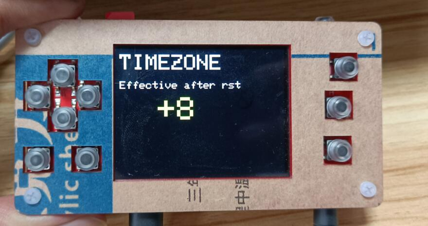
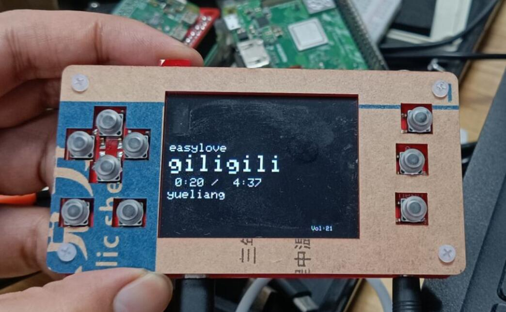

# ESP32 PLAY (NOT READY)


```c++
/*
Version:		V1.0
Author:			Vincent
Create Date:	2021/8/31
Note:
	
*/
```





[toc]

# Makerfabs

[Makerfabs home page](https://www.makerfabs.com/)

[Makerfabs Wiki](https://makerfabs.com/wiki/index.php?title=Main_Page)


# ESP32 PLAY

## Intruduce

Product Link ：[ESPlay Micro - Open Source ESP32 Game Console](https://www.makerfabs.com/esplay-micro.html) 

Wiki Link :  []() 


ESPlay Micro is a Handheld game console based on ESP32, which is from Espressif with great functionality and really mature on the software development side. This project most inspired by Odroid Go and Pocketsprite, those devices are great and have well community support, but some of them had some issues that can be updated. Odroid Go had shared its SPI for both display and SD card, and they need patched esp-IDF version for it and SD card not work very well in SPI mode, Then Pocketsprite only has esp32 wroom module without psram and also without SD card support so limited portability for saving collection of games.

So that is what this ESPlay micro updated. With SD card support added, customers can collect many more games. High quality sound I2S DAC also added to make It possible a good Walkman.

Note that there only the PCBA, USB cable, and SD card, without case and battery, you will need a lipo battery, or USB charger, to start to play. Makerfabs is also designing some cases for this, but need some more time for us to make a reasonable solution.


## Feature

- ESP32 WROVER, Dual-core processor with Integrated 4MB Flash + 4MB PSRAM
- Integrated WIFI and Bluetooth 4 BLE
- 2,4" ILI9341 TFT Panel
- More button (expanded via PCF8574 I2C GPIO)
- Micro SD slot connected to SDMMC Host in 1 Line Mode for saving GPIO pin
- Integrated I2S DAC via UDA1334A
- Integrated USB to Serial for programming and debugging using CH340C
- Built-in TP4056 Li-Po charger
- I2C port for expandable function
- 3.5mm Headphone jack
- Smaller Size, PCB only 100 x 50 mm


### Front:



### Back:




# Example

Some hardware test demos and a NTP clock + MP3 demo.


## Equipment list

- ESPlay Micro
- Micro SD card
- Stereo(3.5mm Audio Cable)


## Compiler Options

**If you have any questions，such as how to install the development board, how to download the code, how to install the library. Please refer to :[Makerfabs_FAQ](https://github.com/Makerfabs/Makerfabs_FAQ)**

- Install board : ESP32 .
- Install library : Adafruit_GFX library.
- Install library : Adafruit_ILI9341 library.
- Install library : PCF8574_library
- Install library : Adafruit_SGP30

- Insert a Micro SD card into ESPlay Micro.
- Upload codes, select "ESP32 Wrover Module" and "Huge APP"
- Connect stereo to ESPlay Micro


## Example List

### button_test

Simple Demo to test key response. Only L, R and MENU keys are directly connected to the IO pin, other keys are connected through PCF8574.

### display_test

Graph test demo.

### sd_test

Need SD card, use SDIO protocol, not SPI. Use SDMMC library.

### audio_test

Need SD card and a wav or mp3 file in SD card, need change filename to yours.

```c++
audio.connecttoFS(SD_MMC, "/yueliang.wav"); //ChildhoodMemory.mp3  //MoonRiver.mp3 //320k_test.mp3
```

### i2c_scp30_test

Checking TVOC and eCO2 via SGP30 sensor. Need connect a SGP30 sensor to I2C port.


### mp3_clock

This routine contains a clock that can be calibrated over WIFI, setting the time zone and alarm clock. And it has MP3 function.

#### Button Function

- L: Change clock mode or mp3 mode.
- L: Reset WiFi config.
- B: Change page(Clock mode)
- A: Change line(Clock mode)
- MENU: Add value(Clock mode)
- UP: Last song(MP3 mode)
- DOWN: Next song(MP3 mode)
- STATE: Volume down(MP3 mode)
- SELECT: Volume up(MP3 mode)







